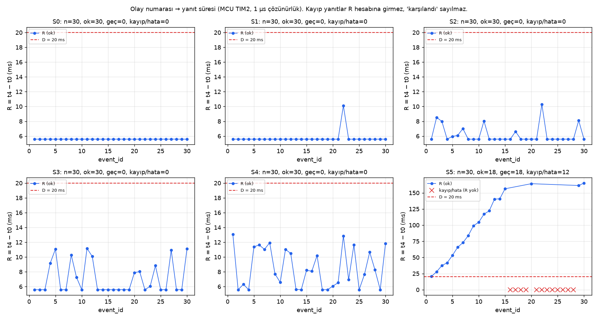
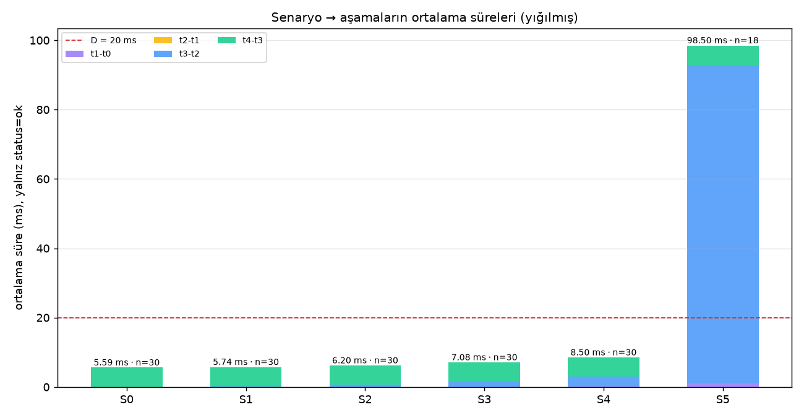
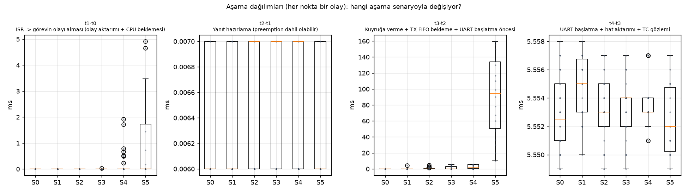
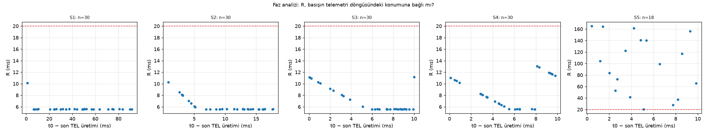

# Rapor: Yük Altında Buton Yanıt Süresi (Gerçek Kart Ölçümleri)

| | |
|---|---|
| Kart | STM32F407G-DISC1, 168 MHz |
| Firmware | `hafta01-1.0.0`, `-O2`. Kaynak kod teslim commit'indekiyle aynıdır (§7). |
| Ölçüm | 2026-09-26/27. Her senaryoda 30 kabul edilen basış; toplam 180 olay |
| Ham veri | [../measurements/](../measurements/): `S0.csv … S5.csv`, `Sx_counters.csv`, `raw/Sx_session.log` |
| Özet | [../measurements/summary.csv](../measurements/summary.csv) · [results_tables.md](results_tables.md) |
| Grafik kodu | [scripts/analyze.py](scripts/analyze.py) (tüm grafikler aynı ham CSV'den) |

## 1. Yöntem
- Deney koşulları [../docs/gereksinim.md](../docs/gereksinim.md) §4–§6'dadır.
- Zaman damgaları MCU TIM2'den (1 µs) alınır. Farklar mod 2³² hesaplanır.
- Yalnızca `status=ok` olaylar R istatistiğine girer. Kayıp yanıtlar ayrı sayılır ve "deadline karşılandı" kapsamına alınmaz.
- Deney akışı kartın mavi butonuyla yönetildi. Boştayken kısa basış senaryo değiştirir, uzun basış START verir. 30. olayın yanıtı hattan çıktıktan sonra STOP ve DUMP otomatik çalışır. Böylece son olay da tam yük altında ölçülür.
- PC arayüzü yalnızca UART'tan gelen veriyi dinledi. Arayüz karta hiçbir veri göndermedi; ölçüme karışmadı.

## 2. Sonuçlar

### 2.1 Yanıt süresi (ms)
| Senaryo | Koşul | ok / olay | Deadline karşılandı | 20 ms'yi aşan | Kayıp | R min | R ort. | R p95 | **R gözlenen maks.** | **min pay** |
|---|---|---|---|---|---|---|---|---|---|---|
| S0 | Telemetri kapalı | 30/30 | 30 | 0 | 0 | 5,58 | 5,59 | 5,59 | **5,59** | **+14,41** |
| S1 | 10 Hz | 30/30 | 30 | 0 | 0 | 5,58 | 5,74 | 5,59 | **10,11** | **+9,89** |
| S2 | 50 Hz | 30/30 | 30 | 0 | 0 | 5,58 | 6,20 | 8,34 | **10,29** | **+9,71** |
| S3 | 100 Hz | 30/30 | 30 | 0 | 0 | 5,58 | 7,08 | 11,09 | **11,17** | **+8,83** |
| S4 | 100 Hz + 2 ms iş | 30/30 | 30 | 0 | 0 | 5,58 | 8,50 | 12,44 | **13,06** | **+6,94** |
| S5 | 100 Hz + 5 ms iş | 18/30 | **0** | **18** | **12 tx_drop** | 20,47 | 98,50 | 164,31 | **165,16** | **−145,16** |

### 2.2 Aşama ortalamaları ve maksimumları (ms, yalnız ok)
| Senaryo | t₁−t₀ ort / maks | t₂−t₁ ort | t₃−t₂ ort / maks | t₄−t₃ ort |
|---|---|---|---|---|
| S0 | 0,007 / 0,007 | 0,006 | 0,019 / 0,020 | 5,553 |
| S1 | 0,007 / 0,007 | 0,006 | 0,170 / 4,544 | 5,555 |
| S2 | 0,006 / 0,007 | 0,007 | 0,631 / 4,724 | 5,553 |
| S3 | 0,007 / 0,024 | 0,007 | 1,513 / 5,582 | 5,553 |
| S4 | **0,216 / 1,918** | 0,007 | 2,719 / 5,589 | 5,554 |
| S5 | **1,086 / 4,914** | 0,006 | **91,855 / 159,596** | 5,552 |

### 2.3 Kayıplar ve MCU doğrulama sayaçları
| Senaryo | btn_drop | tx_drop | tx_error | timeout | log_overflow | TEL gönderilen / düşen | Ölçülen TEL periyodu (µs) | Ölçülen CPU işi (µs) |
|---|---|---|---|---|---|---|---|---|
| S0 | 0 | 0 | 0 | 0 | 0 | 0 / 0 | — | — |
| S1 | 0 | 0 | 0 | 0 | 0 | 380 / 0 | 99 587–100 000 | — |
| S2 | 0 | 0 | 0 | 0 | 0 | 870 / 0 | 19 156–20 000 | — |
| S3 | 0 | 0 | 0 | 0 | 0 | 2 167 / 0 | 9 279–10 004 | — |
| S4 | 0 | 0 | 0 | 0 | 0 | 2 468 / 0 | 9 597–10 000 | 2 001–2 007 |
| S5 | 0 | **12** | 0 | 0 | 0 | 2 551 / **3** | 9 443–10 000 | 5 003–5 013 |

Periyot minimumlarının 10/20/100 ms'nin altında kalmasının sebebi ilk periyottur: START tick sınırına denk gelmez, sonraki periyotlar tick'e hizalıdır. CPU işi kalibrasyonu, hedefin %0,3 yakınında çıktı.

## 3. Grafikler

| | |
|---|---|
|  | Olay numarası → R, 20 ms deadline çizgisi. S5'te merdiven ve kayıplar (×) |
|  | Senaryo → aşama ortalamaları (yığılmış) |
|  | Aşama dağılımları: hangi aşama değişiyor |
|  | R ve basışın telemetri döngüsündeki konumu |

Zaman çizelgesi (gerçek olaylar): [../docs/zaman-cizelgesi.md](../docs/zaman-cizelgesi.md)

## 4. Ne değişti, ne kadar, hangi koşulda, hangi aşamada?

### 4.1 Taban: S0, R = 5,59 ms
R'nin **%99,4'ü UART hat süresidir.** RTOS'un toplam payı yalnızca ≈ 33 µs:
- ISR → ButtonTask: 7 µs
- Yanıt hazırlama: 6 µs
- Kuyruk → UART başlatma: 20 µs

30 basıştaki yayılım 8 µs'dir.

Ölçümden çıkan bir düzeltme: 64 baytın hat süresi 115200 baud için hesaplanan 5,556 ms değil, **≈ 5,547 ms**'dir. 42 MHz APB1 saatinden üretilebilen en yakın baud hızı 115 385'tir (BRR = 22,75, %+0,16). t₄−t₃'teki kalan ≈ 6 µs, DMA başlatma ve TC kesmesinin işlenmesidir.

### 4.2 Telemetri frekansı (S0 → S1 → S2 → S3): yalnızca t₃−t₂ değişiyor
| | S1 (10 Hz) | S2 (50 Hz) | S3 (100 Hz) |
|---|---|---|---|
| Hat kullanımı (telemetri) | %5,5 | %27,7 | %55,5 |
| t₃−t₂'de bekleyen basış | 1/30 | 9/30 | 12/30 |
| t₃−t₂ ortalaması | 0,17 ms | 0,63 ms | 1,51 ms |
| t₃−t₂ maks (≤ bir mesaj süresi) | 4,54 ms | 4,72 ms | 5,58 ms |

- **Neden:** Yanıt, FIFO'da o an hatta olan TEL mesajının bitmesini bekler.
- **Kanıt:** `R_vs_phase`'te S3 testere dişidir. Basış TEL üretiminden hemen sonra gelirse R ≈ 11,1 ms'dir. Faz arttıkça R doğrusal düşer. ~5,5 ms sonrasında hat boştur ve R = 5,58 ms'de sabit kalır. Yani bekleme = hatta kalan TEL süresi.
- **Değişmeyenler:** t₁−t₀ (6–7 µs), t₂−t₁ (6–7 µs) ve t₄−t₃ (5,549–5,558 ms) bütün frekanslarda aynıdır. Tek istisna S3'te bir olayda t₁−t₀ = 24 µs'tir: basış, TelemetryTask'ın ~17 µs'lik TEL biçimlendirmesine denk geldi.
- **Birikme yoktur:** R olay numarasıyla artmaz, TEL kaybı yoktur, en uzun bekleme bir mesaj süresini aşmaz.
- **Sonuç:** 100 Hz telemetri, en kötü durumda deadline payını 14,4 ms'den **8,8 ms'e** düşürür. Deadline korunur.

### 4.3 CPU yükü 2 ms (S3 → S4): ikinci bir gecikme kaynağı, t₁−t₀
- **t₁−t₀ ilk kez büyür:** 7/30 basışta, 0,23–1,92 ms. Basış TelemetryTask'ın (öncelik 3) 2 ms'lik işine denk gelince ButtonTask (öncelik 2) işin bitmesini bekler. Etkilenen basış oranı %23; CPU işinin payı %20.
- **t₃−t₂ daha sık büyür:** 22/30 basış. İşini bitiren TelemetryTask TEL'i BTN'den **önce** kuyruğa koyar. BTN önce kalan işi, sonra TEL'in tamamını bekler. R maks ≈ 1,9 + 5,6 + 5,6 ≈ **13,06 ms**.
- **Görev aç kalmıyor:** BTN gönderimleri TEL üretiminden ≈ 5,58 ms sonra, yani önceki TEL hattan çıkar çıkmaz başlar. Sınır hâlâ UART hattıdır.
- **Sonuç:** Deadline korunur; min pay **+6,94 ms**. Kayıp ve birikme yoktur.

### 4.4 CPU yükü 5 ms (S4 → S5): sistem çöküyor, sebep UART değil CPU açlığı
- **İlk basış bile kaçırıyor:** R = 20,47 ms, pay −0,47 ms. Aşamalar: t₁−t₀ = 4,91 ms (işin bitmesini bekleme), t₃−t₂ = 10,00 ms.
- **Birikme:** Sonraki her basışta t₃−t₂ ≈ **10 ms artar**: 10,0 → 20,0 → 30,0 → 36,1 → 47,5 → 60,0 → … → 159,6 ms. `R_vs_event` merdiven şeklindedir.
- **Kuyruk doyuyor:** ~15. basışta TX kuyruğu (16) dolar. 12 yanıt düşürülür (`tx_drop`), 3 TEL düşer, R ≈ 160–165 ms'de doyar.
- **Deadline:** 30 olaydan **hiçbiri** karşılanmadı: 18 geç, 12 kayıp.
- **Mekanizmanın kanıtı:** 18 BTN gönderiminin **tamamı**, bir TEL üretildikten **22–24 µs sonra** başladı (S4'te ≈ 5 580 µs sonra). UartTxTask (öncelik 1) yalnızca TelemetryTask 5 ms'lik işini bitirip bloklandığında CPU alabiliyor. Önceki mesajın TC'si 5 + 5,55 = 10,55 ms'de, yani bir sonraki işin içinde geldiği için UartTxTask **periyot başına yalnızca bir mesaj** başlatabiliyor. TelemetryTask da periyot başına bir TEL ürettiği için hizmet hızı geliş hızına eşit. Her BTN kuyrukta kalıcı olarak +1 mesaj (≈ +10 ms) bırakıyor.
- **Hat darboğaz değil:** Telemetrinin hat kullanımı %55,5 idi. "UART yetmiyor" açıklaması yanlıştır.

## 5. Hipotezlerin değerlendirmesi ([analiz.md](analiz.md))
| Hipotez | Karar | Kanıt |
|---|---|---|
| H0: t₄−t₃ yükten bağımsız | ✅ **Desteklendi** | Tüm senaryolarda 5,549–5,558 ms (`stages_box`) |
| H1: Frekans yalnız t₃−t₂'yi uzatır, ≤ 1 mesaj | ✅ **Desteklendi** | §4.2 tablosu; t₁−t₀/t₂−t₁ sabit; faz grafiğinde testere dişi; maks 5,58 ms |
| H2: 2 ms iş t₁−t₀'ı ≤ 2 ms uzatır, birikme yok | ✅ **Desteklendi** | t₁−t₀ maks 1,918 ms; R olaydan bağımsız; kayıp 0; `work` 2001–2007 µs |
| H3: 5 ms işte UartTxTask aç kalır → birikme | ✅ **Desteklendi** | t₃−t₂ 10 ms adımlarla büyür; t₃ her zaman TEL'den 22–24 µs sonra; 12 tx_drop; `work_min` 5003 µs > 4,45 ms eşiği |

## 6. Mühendislik sonuçları
1. **Frekans ile CPU yükü farklı aşamaları etkiliyor.** Telemetri frekansı yalnızca t₃−t₂'yi uzatır ve etkisi bir mesaj süresiyle sınırlıdır. CPU yükü önce t₁−t₀'ı uzatır. Eşik aşılınca (C + L > T) TX görevini aç bırakır ve **sınırsız birikmeye** yol açar.
2. **Kritik eşik ≈ T − L = 10 − 5,55 ≈ 4,45 ms.** 2 ms güvenli, 5 ms çöküş. Aradaki değerler ölçülmedi.
3. **En düşük öncelikli UART sahibi görev, yük altında darboğaz olur.** Önerilen ek deneyler (bu karşılaştırmanın dışında): UartTxTask'ın önceliğini yükseltmek, BTN'i kuyruğun önüne koymak (`xQueueSendToFront`), baud'u artırmak. Bkz. [../docs/ROADMAP.md](../docs/ROADMAP.md).

## 7. Sınırlar ve açık noktalar
- t₀ fiziksel basış anı değildir. Buton mekaniği ve karttaki RC filtre ölçülmedi.
- t₄'e TC kesmesinin gözlem gecikmesi (birkaç µs) dahildir.
- n = 30: "gözlenen maksimum" kanıtlanmış worst-case değildir. p95 değeri 30 örnekle kabadır.
- S3'te bekleyen basış oranı %40, hat kullanımı ise %55,5. 30 örnek ve insan zamanlamasıyla bu sapma beklenebilir. Faz grafiği mekanizmayı doğruluyor.
- S5'teki birikme, basışlar arasındaki süreye ve basış sayısına bağlıdır. Yalnızca buton olayları kuyruk birikmesi yaratır; telemetri tek başına S5'te de dengededir.
- **Firmware sürümü:** Karttaki derleme `INF,git = a7c4a7c` bildiriyor. Bu derleme, o commit'in üzerine henüz commit'lenmemiş değişiklikler (kart butonuyla kontrol) eklenerek yapıldı. Ölçümlerden sonra firmware kaynağında değişiklik yapılmadı. Teslim commit'indeki kaynak, ölçülen ikiliyle aynıdır.
- Tüm senaryolar aynı ikili ve aynı ayarlarla, arada yeniden yükleme yapılmadan ölçüldü.
