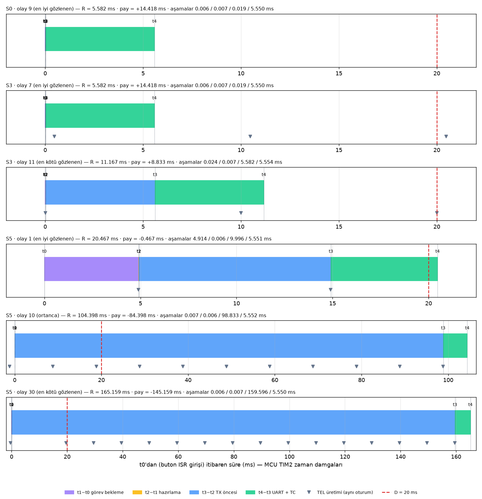

# Zaman Çizelgesi: Üç Senaryo, R ve Deadline Payı (Gerçek Ölçüm)

> Bu sayfadaki grafik ve tablo, karttan alınan **gerçek** t₀…t₄ zaman damgalarından üretilir. Varsayılan senaryolar S0, S3 ve S5'tir. Yeniden üretmek için:
> ```bash
> interface/.venv/Scripts/python analysis/scripts/analyze.py --timeline S0,S3,S5
> ```



## R ve deadline payı
Tablo: [zaman-cizelgesi_tablo.md](zaman-cizelgesi_tablo.md)

Hesaplar:
- R = t₄ − t₀
- Pay = D − R, D = 20 ms. Pay ≥ 0 ise deadline karşılanmıştır.
- Farklar mod 2³² alınır; tüm zamanlar MCU TIM2 saatindendir (1 µs).

## Grafik nasıl okunur?
- Her satır tek bir gerçek buton olayıdır. Her senaryodan **en iyi**, **ortanca** ve **en kötü gözlenen** olaylar seçilir; R'leri birbirine 50 µs'den yakınsa tekrar çizilmez.
- Renkli bölümler dört aşamayı gösterir: t₁−t₀ görev bekleme, t₂−t₁ hazırlama, t₃−t₂ TX öncesi bekleme, t₄−t₃ UART + TC.
- ▼ işaretleri aynı oturumda TelemetryTask'ın TEL ürettiği anlardır. Bu anlar da MCU saatindendir. Basışın bir TEL'den hemen sonra mı geldiğini gösterirler.
- Kırmızı kesikli çizgi: D = 20 ms.

## Okumaya yardımcı sabit
64 bayt × 10 bit / 115200 baud = 5,556 ms. Kartın gerçek baud'u 115 385'tir (42 MHz APB1, BRR = 22,75); bu yüzden ölçülen hat süresi **≈ 5,547 ms**, t₄−t₃ ise ≈ 5,553 ms'dir. t₃−t₂'nin bu değerin katları kadar büyümesi, yanıtın kuyrukta başka mesajları beklediğini gösterir.

## Yorum (gerçek ölçüm, 2026-09-27)

| Senaryo | Olay | R | Pay | Belirleyici aşama |
|---|---|---|---|---|
| **S0** | en iyi = ortanca = en kötü (yayılım 8 µs) | 5,58–5,59 ms | **+14,41 ms** | t₄−t₃ (hat süresi). RTOS payı ≈ 33 µs. |
| **S3** | en iyi, olay 7 | 5,58 ms | +14,42 ms | Basış hat boşken geldi; S0 ile aynı. |
| **S3** | en kötü, olay 11 | 11,17 ms | **+8,83 ms** | **t₃−t₂ = 5,58 ms**: basış TEL üretiminin hemen ardından geldi, yanıt TEL'in tamamını bekledi. |
| **S5** | en iyi, olay 1 | 20,47 ms | **−0,47 ms** | **t₁−t₀ = 4,91 ms** (5 ms CPU işini bekleme) + **t₃−t₂ = 10,00 ms** (UartTxTask'ın bir sonraki iş bitimine kadar aç kalması). |
| **S5** | ortanca, olay 10 | 104,40 ms | −84,40 ms | t₃−t₂ = 98,83 ms: kuyrukta önceki basışlardan kalan ~9 mesaj |
| **S5** | en kötü, olay 30 | 165,16 ms | **−145,16 ms** | t₃−t₂ = 159,60 ms: kuyruk (16) dolu |

- Grafikte ▼ işaretleri S5'te 10 ms arayla dizilir. BTN'in hattan çıkışı (t₃) her zaman bir ▼'den 22–24 µs sonra başlar. UART görevi yalnızca TelemetryTask işini bitirince çalışabiliyor.
- **t₄−t₃ her satırda ≈ 5,55 ms'dir.** UART aşaması hiçbir yükte değişmedi.
- Ayrıntılı analiz: [../analysis/report.md](../analysis/report.md)
