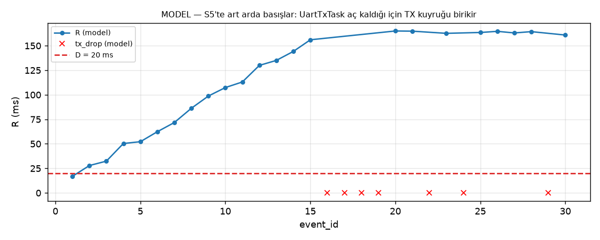

# Zaman Çizelgesi: Üç Senaryo, R ve Deadline Payı

> ⚠️ **Bu sayfadaki bütün sayılar MODEL TAHMİNİDİR, ölçüm değildir.** Ölçümden önce hipotez kurmak için üretildi. Gerçek kart sonuçları [../analysis/report.md](../analysis/report.md) içindedir. Model: [../analysis/model/rtos_model.py](../analysis/model/rtos_model.py). Yeniden üretmek için: `python analysis/model/timeline.py`


## 1. Sabitler ve varsayımlar

| Büyüklük | Değer | Kaynak |
|---|---|---|
| Hat süresi L (64 B, 8N1, 115200) | 64 × 10 / 115200 = **5,556 ms** | Hesap |
| TEL periyodu T (S3–S5) | 10 ms | Senaryo |
| CPU işi C (S5) | 5 ms | Senaryo |
| ISR → ButtonTask (t₁−t₀, yüksüz) | 10 µs | **Varsayım** (S0 ölçümüyle güncellenecek) |
| Yanıt hazırlama (t₂−t₁) | 15 µs | **Varsayım** |
| UartTxTask kuyruktan alma → t₃ | 8 µs | **Varsayım** |
| t₄ − t₃ − L (DMA başlatma + TC gözlemi) | 20 µs | **Varsayım** |

## 2. Üç senaryo

### S0 — telemetri kapalı (referans)
Hatta başka mesaj yok, CPU boş.

| Aşama | Süre |
|---|---|
| t₁−t₀ görev bekleme | 0,010 ms |
| t₂−t₁ hazırlama | 0,015 ms |
| t₃−t₂ TX öncesi | 0,013 ms |
| t₄−t₃ UART + TC | 5,576 ms |
| **R** | **5,61 ms** |
| **Pay = 20 − R** | **+14,39 ms** ✅ |

R neredeyse tamamen hat süresidir: 115200 baud'da 64 bayt 5,556 ms sürer. Bu, sistemin **alt sınırıdır**; hiçbir yük azaltması R'yi bunun altına indiremez.

### S3 — 100 Hz telemetri, en kötü faz
Basış, bir TEL mesajı hatta çıkmaya başladığı anda gelir. ButtonTask hemen çalışır: t₁−t₀ ≈ 0,03 ms, çünkü TelemetryTask'ın 20 µs'lik biçimlendirmesi araya girer. BTN mesajı ise FIFO'da TEL'in bitmesini bekler.

| Aşama | Süre |
|---|---|
| t₁−t₀ | 0,030 ms |
| t₂−t₁ | 0,015 ms |
| t₃−t₂ | **5,605 ms** ← önündeki TEL'in hat süresi |
| t₄−t₃ | 5,576 ms |
| **R** | **11,23 ms** |
| **Pay** | **+8,77 ms** ✅ |

Analitik sınır: R_max ≈ 2L + ε ≈ 11,2 ms. Bekleme yalnızca t₃−t₂ aşamasında birikir ve en fazla bir mesaj süresi (L) kadardır. Basışların yaklaşık %55,6'sı (hat kullanım oranı kadar) bu beklemeyle karşılaşır. Beklenen ortalama t₃−t₂ ≈ 0,556 × L/2 ≈ 1,6 ms.

### S5 — 100 Hz + 5 ms CPU, en kötü faz (ilk basış)
Basış, TelemetryTask'ın 5 ms'lik işi başlarken gelir (φ = 0,1 ms).

| Aşama | Süre | Neden |
|---|---|---|
| t₁−t₀ | **4,930 ms** | ButtonTask (2), TelemetryTask'ın (3) işinin bitmesini bekler |
| t₂−t₁ | 0,015 ms | |
| t₃−t₂ | **9,991 ms** | FIFO'da önde bir TEL var. Asıl sebep aşağıda. |
| t₄−t₃ | 5,576 ms | |
| **R** | **20,51 ms** | |
| **Pay** | **−0,51 ms** ❌ | |

**Hat neden boşta kalıyor?** Önceki TEL'in TC'si 10,6 ms'de gelir; bu an TelemetryTask'ın bir sonraki 5 ms'lik işinin [10, 15] ms **içine** düşer. En düşük öncelikli UartTxTask, BTN mesajını ancak 15 ms'de başlatabilir. **Hat 10,6–15 ms arasında boştur ama mesaj kuyrukta bekler.** Bu fazdaki darboğaz UART kapasitesi değil, UartTxTask'ın CPU'ya erişememesidir.

Analitik ifade (tek basış, 0 ≤ φ < T):

```
R(φ) ≈ T + C + ε_tel + ε_utx + L + ε_tx − φ ≈ 20,61 ms − φ
Kaçırma: R > 20 ms  ⇔  φ < ~0,6 ms  (tek basışların ~%6'sı)
```

## 3. Tüm senaryolar: tek basış, faz taraması (model)

Kaynak: [../analysis/model/predictions.csv](../analysis/model/predictions.csv)

| Senaryo | R min | R ort. | R maks | min pay | t₁−t₀ maks | t₃−t₂ ort. | t₃−t₂ maks | Kaçırma oranı |
|---|---|---|---|---|---|---|---|---|
| S0 | 5,61 | 5,61 | 5,61 | +14,39 | 0,01 | 0,01 | 0,01 | 0 |
| S1 | 5,61 | 5,77 | 11,23 | +8,78 | 0,03 | 0,17 | 5,61 | 0 |
| S2 | 5,61 | 6,40 | 11,23 | +8,78 | 0,03 | 0,80 | 5,61 | 0 |
| S3 | 5,61 | 7,19 | 11,23 | +8,78 | 0,03 | 1,59 | 5,61 | 0 |
| S4 | 5,61 | 8,52 | 13,23 | +6,78 | 2,03 | 2,71 | 5,61 | 0 |
| S5 | 10,66 | 15,65 | 20,64 | **−0,64** | 5,03 | 8,77 | 10,02 | %6,5 |

(Tüm süreler ms.)

## 4. Art arda basışlar: S5'te birikme (model)



S5'te UartTxTask her 10 ms'lik periyotta **yalnızca bir** mesaj başlatabilir: 5 ms iş + 5,56 ms hat süresi > 10 ms. TelemetryTask da her periyotta bir TEL ürettiği için hizmet hızı geliş hızına eşittir. Her BTN mesajı kuyrukta **kalıcı olarak +1 mesajlık (≈ +10 ms)** birikme bırakır.

Modelin öngörüsü:
- R her basışta ≈ 10 ms artar (merdiven şeklinde).
- ~15 basıştan sonra TX kuyruğu (16) dolar: `tx_drop` ve TEL kayıpları başlar.
- R ≈ 160–165 ms'de doyuma ulaşır.
- İlk basış dışındaki tüm tamamlanmış yanıtlar deadline'ı kaçırır.

Kritik eşik (modelde): C ≳ T − L − ε ≈ **4,39 ms**. Bu eşiğin altında (ör. S4, C = 2 ms) sistem kararlıdır.
